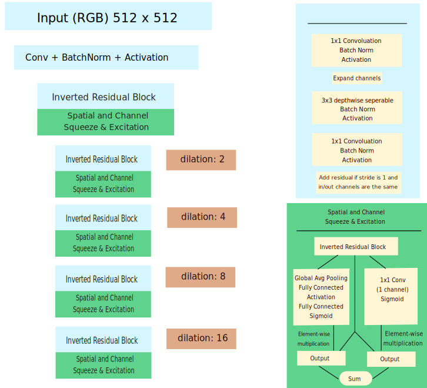
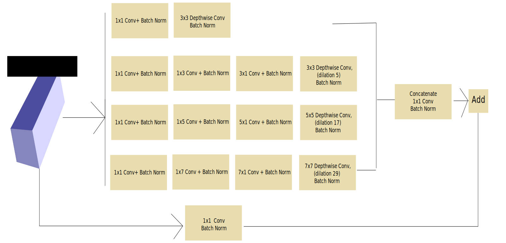
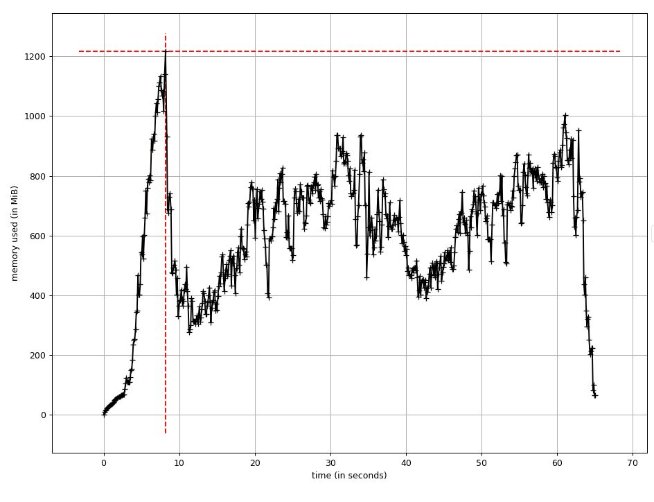

# Text Segmentation and Image Inpainting 

This is an ongoing project that aims to solve a simple but teddies procedure: remove texts from an image. It will reduce commic book translators' time on erasing Japanese words.

The road ahead:
* Detect and generate text mask from an image
* Use the generated mask to white out words
* Apply image inpainting to reduce color inconsistancy.

# Usage
Please see the "Examples" folder

# Models
Targeted users generally don't have high spec GPUs or CPUs, so I aim to use/customize fast and memory efficient deep neural nets that can run on CPU only environment. 

## Text Segmentation
The model contains three parts: encoder, feature pooling, and decoder.

### Encoder
The backbone is [Mobile Net V2](https://www.google.com/search?q=mobile+net+v2&ie=utf-8&oe=utf-8&client=firefox-b-1-ab), and I append a [Spatial and Channel Squeeze & Excitation Layer](https://arxiv.org/abs/1803.02579). The original model has width multiplier of 1, and I change it to 2. The number of parameters in the convolution part doubles, but the run time increases from 3 seconds to 7 seconds. In addition, I replace the outstride 16 and 32 blocks to dilatation to enlarge field of view ([DeepLab V3](https://arxiv.org/abs/1706.05587), [DeepLab V3+](https://arxiv.org/abs/1802.02611)) .

### Feature Pooling
The model is [Receptive Field Block (RFB)](https://arxiv.org/abs/1711.07767). It is similar to DeepLab v3+'s Atrous Spatial Pyramid (ASP) pooling, but RFB use separable convolution ([Effnet](https://arxiv.org/abs/1801.06434)-like without pooling) with larger kernel size (I choose 3,5,7) followed by  atrous convolution. 

### Decoder
Deocder follows Deeplab V3+: features are up scaled x2 and concatenated with 1/4 encoder features, and then they are up-scaled back to the same size of input image. 

##
I don't use a text-detection model such as Textbox Plus Plus, Single Shot MultiBox Detector, or Faster R-CNN because I don't have images that have bounding boxes on text regions. Real world image databases don't fit this project's goal.

To generate training data, I use two copies of images: one is the origin image, and the other one is text clean. These images are abundant and easy to obtain from either targeted users or web-scraping.  By subtracting the two, I get a mask that shows the text region. The idea is inspired by He, etc's  [Single Shot Text Detector with Regional Attention](https://arxiv.org/abs/1709.00138) and He,etc's [Mask-R-CNN](https://arxiv.org/abs/1703.06870). Both papers show a pixel level object detection. 

##

The model is trained on black/white images, but it also works for color images. 

Example:

* The model has not converged yet after 10 hours of training. 

Source: [Summer Pockets](http://key.visualarts.gr.jp/summer/)

More examples will be added after I obtain authors' consent. 

## Image Inpainting
I have not started this part yet. I plan use the first model to generate more training data for this part.
The model will be a UNet-like architecture, but all convolutions will be swapped by gated partial convolutions. Details can be found in Yu, etc's paper [Free-Form Image Inpainting with Gated Convolution](https://arxiv.org/abs/1806.03589) & [ Generative Image Inpainting with Contextual Attention](https://arxiv.org/abs/1801.07892) and Liu, etc's paper [ Image Inpainting for Irregular Holes Using Partial Convolutions](https://arxiv.org/abs/1804.07723). These papers are very interesting and show promising results. 

## Current Stage
#### Text segmentation

I train several versions of Mobile Net V2 with various settings and pre-trained check points, but none of them works perfect even on my training images. The problem might be the Mobile Net V2's size.  ResNet 50 & 101, which have more than 10x numbers of  parameters, have much better performance records. 

Another problem is that models are pre-trained on photos from the real word, but my training images are completely different. For example, ImageNet's mean and std (RGB) are [[0.485, 0.456, 0.406] and [0.229, 0.224, 0.225]](https://github.com/tonylins/pytorch-mobilenet-v2/issues/9), but images from [Danbooru2017](https://www.gwern.net/Danbooru2017#rsync), which come close to my training samples,  have mean [ 0.4935,  0.4563,  0.4544] and std [0.3769,  0.3615,  0.3566].  Transfer learning might not work well ([Torralba & Efros, 2011](http://citeseerx.ist.psu.edu/viewdoc/download?doi=10.1.1.208.2314&rep=rep1&type=pdf)). 

##### July 10th
I implement a naive one-vs-all binary CNN model that treats each label as independent. The error rate is unsurprisingly terrible. I then implement a [CNN-LSTM model](https://arxiv.org/abs/1711.02816)  which recurrently finds attention regions and detects labels. Such approach is bounding-box free and similar to one-stage detection such as SSD.

Given the official code has not been released yet, I take my freedom to tweak and change model details: the paper uses fully connected layers in between feature maps and LSTM, and its lost function contains 4 anchor distance loss. 

I  use global average pooling to send concatenated feature maps into LSTM and let it learn the residual parts of anchor position, which means LSTM predicts the distance away from the anchor points. That makes the LSTM part looks around the image. In addition, in the loss function, I add bounding constrain on the spatial transform matrix (its horizontal absolute sum <=1 ) so that attention regions will be inside the image and not be zero padded. That makes my global pooling effective. 

##### July  13th 
Training on [Danbooru2017](https://www.gwern.net/Danbooru2017#rsync) is completed. I select the top 500 labels from descriptive tags and 113K images that have the most tags. Each training sample has at least 20 tags, and the top 1,000 images have more than 100 tags. The model is trained on Nvidia-V100 for over 20 hours with cyclical learning rate. One epoch takes around 1.5 hours. Since the goal is transfer learning, I stop training before the model converges. 

 ##### July 14th 
 Training on text segmentation is completed. Training takes 2 stages: I freeze the encoder in the first stage and monitor the performance on the  validation set. Before the model over-fits the training samples, I then re-train all parameters. 
 
 I have only 2k training images, but the model performance seems acceptable. I need to collect more data since the model is over-fitting the samples. 

Memory usage: 4 CPUs and 8 images.
 
 
 
## Notes on Hyper-parameters 
* Cyclical learning rate is a great tool but needs to pick optimal base & max learning rate. Learning rate range can be as large as 0.1-1 with few epochs ([Exploring loss function topology with cyclical learning rates](https://arxiv.org/abs/1702.04283)).
* Weighted binary cross entropy loss may be better than focal loss. 
Witch cyclical learning rate from 1e-4 ~ 1e-2, and 100 iterations on 200 images.

|         | AP score (validation images)   |
| ------------- |:-------------:| 
| Gamma  0, Background:1, words:2     | **0.2644** | 
| Gamma  .5, Background:1, words:2     | 0.2411 | 
| Gamma  1, Background:1, words:2     | 0.2376 | 
| Gamma  2, Background:1, words:2     | 0.2323 | 
| Gamma  0, Background:1, words:1     | 0.2465 | 
| Gamma  1, Background:1, words:1     | 0.2466 | 
| Gamma  2, Background:1, words:1     | 0.2431| 
| Gamma  0, Background:1, words:5     | 0.2437 | 

* Weight decay should be smaller than 1e-3. 1e-4 is better than 1e-5 when use cyclical learning rate and SGD (with nesterov). 